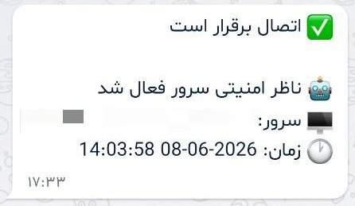
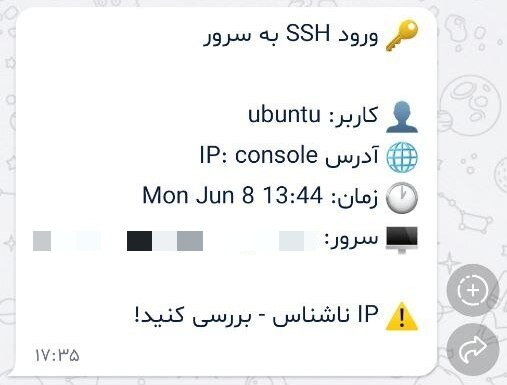
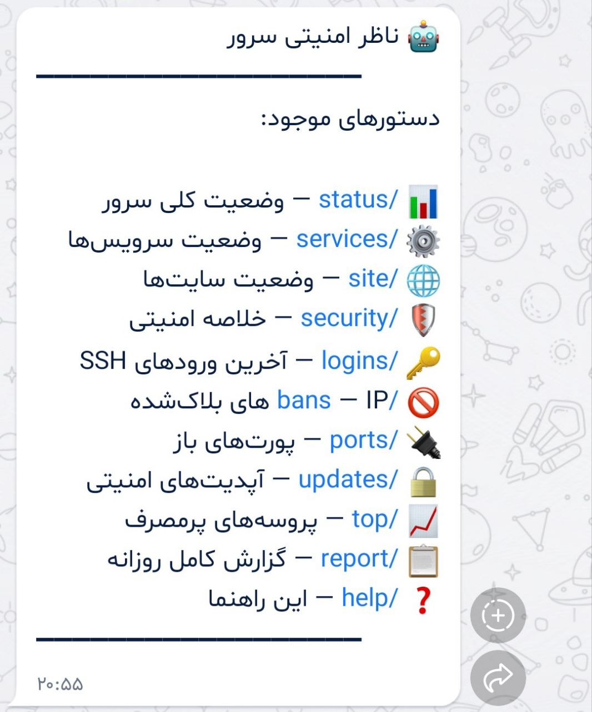
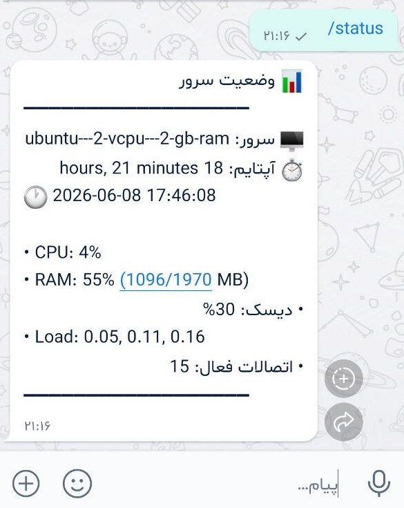
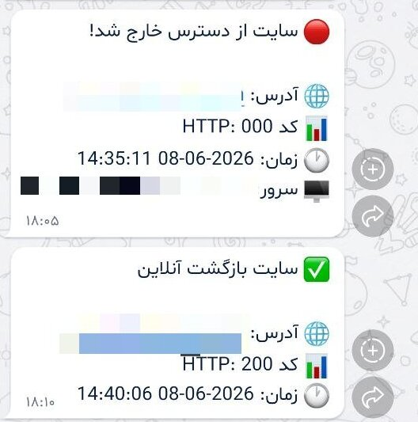

# 🛡 ناظر امنیتی سرور لینوکس

<div dir="rtl">

ابزار **رایگان** و **متن‌باز** برای مانیتورینگ و هشدار امنیتی سرور لینوکس از طریق **بله** یا **تلگرام** — به زبان فارسی


---

## 📱 نمونه پیام‌ها

<table>
  <tr>
    <td></td>
    <td></td>
    <td></td>
  </tr>
</table>

---

## 🤖 بات تعاملی (وجه تمایز)

علاوه بر هشدارهای خودکار، می‌توانید از گوشی به بات **دستور** بدهید و فوری جواب بگیرید — بدون نیاز به SSH زدن یا باز کردن هیچ پنلی.

<table>
  <tr>
    <td></td>
    <td></td>
  </tr>
</table>

**دستورهای بات:**

| دستور | کار |
|-------|-----|
| `/status` | CPU، RAM، دیسک، آپتایم، اتصالات فعال |
| `/services` | وضعیت سرویس‌ها |
| `/site` | وضعیت سایت‌ها |
| `/security` | خلاصه امنیتی (بلاک‌ها، تلاش‌های ناموفق، آپدیت‌ها) |
| `/logins` | آخرین ورودهای SSH |
| `/bans` | IP های بلاک‌شده |
| `/ports` | پورت‌های باز |
| `/updates` | آپدیت‌های امنیتی |
| `/top` | پروسه‌های پرمصرف |
| `/report` | گزارش کامل روزانه |
| `/help` | راهنما |

---

## ✨ قابلیت‌ها

| قابلیت | توضیح |
|--------|-------|
| 🖥 هشدار CPU | اگر مصرف از حد مجاز بالاتر رفت خبر می‌دهد |
| 💾 هشدار RAM | مصرف غیرعادی حافظه را اطلاع می‌دهد |
| 📁 هشدار دیسک | پر شدن فضای ذخیره‌سازی |
| ⚙️ بررسی سرویس‌ها | nginx، fail2ban و هر سرویس دیگری |
| 🌐 بررسی سایت | اگر سایت از دسترس خارج شد فوری خبر می‌دهد + تشخیص اینکه مشکل از اپ است یا CDN |
| 🔑 ورود SSH | هر ورود به سرور + تشخیص IP ناشناس |
| 🚨 حمله SSH | Fail2ban چه IP هایی را بلاک کرد |
| 🔌 پورت جدید | اگر پورت ناشناخته‌ای باز شد هشدار می‌دهد |
| 🔒 آپدیت امنیتی | وجود به‌روزرسانی‌های امنیتی را اطلاع می‌دهد |
| 📄 تغییر فایل‌های مهم | /etc/passwd و /etc/shadow و ... |
| 📊 گزارش روزانه | هر روز صبح خلاصه کامل وضعیت سرور |
| 👥 چند کاربر | ارسال هشدار به چند Chat ID همزمان |

---

## 🚀 نصب سریع

```bash
git clone https://github.com/MSadeghSeyfi/persian-server-monitor.git
cd persian-server-monitor
cp config.conf.example config.conf
nano config.conf       # توکن و شناسه چت را وارد کنید
bash install.sh        # نصب خودکار (cron + سرویس بات)
bash monitor.sh test   # تست اتصال
```

---

## ⚙️ تنظیمات

فایل `config.conf` را ویرایش کنید:

```bash
# پیام‌رسان: bale یا telegram
MESSENGER="bale"

# توکن ربات (از @BotFather دریافت کنید)
BOT_TOKEN="توکن_ربات_خود_را_اینجا_بگذارید"

# شناسه چت — برای چند نفر با کاما جدا کنید: "111,222"
CHAT_ID="شناسه_چت_خود_را_اینجا_بگذارید"

# حدهای هشدار (درصد)
CPU_THRESHOLD=85
RAM_THRESHOLD=85
DISK_THRESHOLD=80

# سرویس‌های مانیتور (با کاما جدا کنید)
MONITOR_SERVICES="nginx,fail2ban,ssh"

# سایت‌های مانیتور (با کاما جدا کنید)
MONITOR_WEBSITES="https://example.com"

# IP های مورد اعتماد برای SSH
TRUSTED_IPS="1.2.3.4"
```

---

## 🤖 ساخت ربات

### در بله یا تلگرام
۱. اپلیکیشن را باز کنید
۲. با `@BotFather` چت کنید
۳. دستور `/newbot` را ارسال کنید
۴. یک نام برای ربات انتخاب کنید
۵. **توکن** دریافت‌شده را در `config.conf` وارد کنید

برای گرفتن **شناسه چت (Chat ID)**: به ربات یک پیام بفرستید، سپس این آدرس را باز کنید (توکن خود را جایگزین کنید):
```
https://tapi.bale.ai/botTOKEN/getUpdates
```
عدد `id` داخل `chat` همان شناسه چت شماست.

---

## ⏰ تنظیم اجرای خودکار

اسکریپت `install.sh` این کار را خودکار انجام می‌دهد. برای تنظیم دستی:

```bash
crontab -e
```

```cron
# بررسی هر ۵ دقیقه
*/5 * * * * /path/to/persian-server-monitor/monitor.sh all

# گزارش روزانه ساعت ۸ صبح
0 8 * * * /path/to/persian-server-monitor/monitor.sh daily
```

---

## 📋 دستورات خط فرمان

```bash
bash monitor.sh test       # تست اتصال به ربات
bash monitor.sh all        # بررسی همه موارد
bash monitor.sh daily      # ارسال گزارش روزانه
bash monitor.sh cpu        # فقط CPU
bash monitor.sh ram        # فقط RAM
bash monitor.sh disk       # فقط دیسک
bash monitor.sh services   # فقط سرویس‌ها
bash monitor.sh websites   # فقط سایت‌ها
bash monitor.sh pm2        # فقط PM2
bash monitor.sh ssh        # فقط ورودهای SSH
bash monitor.sh fail2ban   # فقط Fail2ban
bash monitor.sh ports      # فقط پورت‌های باز
bash monitor.sh updates    # فقط آپدیت‌های امنیتی
bash monitor.sh files      # فقط تغییر فایل‌های مهم
```

---

## 🔔 نمونه هشدارها

هشدار **قطع و وصل شدن سایت** — به‌صورت لحظه‌ای:



---

## 🧪 تست‌شده روی

- Ubuntu 22.04 LTS
- Ubuntu 24.04 LTS
- Debian 11 / 12

---

## 🤝 مشارکت

اگر این پروژه برایتان مفید بود، یک ⭐ بدهید! پیشنهاد و گزارش باگ از طریق Issues خوشحالمان می‌کند.

---

## 📄 مجوز

این پروژه تحت مجوز [MIT](LICENSE) منتشر شده است — استفاده، تغییر و توزیع آزاد است.

---

<p align="center">ساخته شده با ❤️ برای جامعه فارسی‌زبان لینوکس</p>

</div>
